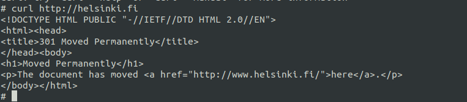

# Part 1

## Exercises

### 1.1 Getting started

```shell
$> docker run -d <image>
$> docker stop <id>
```


### 1.2 Cleanup

```shell
$> docker stop
$> docker system prune
```


### 1.3 Hello Docker Hub


### 1.4

```shell
$> docker exec -it <container-id> sh
```


### 1.5

To init a non-existing ubuntu container:

```shell
$> docker run -i -d --name ubuntu ubuntu:18.04
```

Access container's shell scripting:

```shell
$> docker exec -it ubuntu sh
```

Use command line as normal:

```shell
$> apt-get update
$> apt-get -y install curl
$> curl http://helsinki.fi
```



### 1.6

[Dockerfile](./ex6/Dockerfile)

```shell
$> cd ex6
$> docker build -t docker-clock
$> docker run docker-clock
```


### 1.7

[Dockerfile](./ex17/Dockerfile)

```shell
$> cd ex7
$> docker build -t curler .
$> docker run -it curler
```


### 1.8

```shell
$> docker run -d devopsdockeruh/first_volume_exercise
$> docker cp "<container_id>://usr/app" .
$> docker run -v $(pwd)/app:/usr/app devopsdockeruh/first_volume_exercise
$> cat app/logs.txt
```


### 1.9

```shell
$>docker run -d -p 80 devopsdockeruh/ports_exercise
$>curl localhost:32770
Port configured correctly, generated message in logs.txt
```

### 1.10

[Dockerfile](./ex10/Dockerfile)

```shell
$>docker build .
Successfully built b14bf59c666d
$>docker run -p 5000:5000 b1
```

### 1.11

[Dockerfile](./ex11/Dockerfile)

```shell
$> docker build .
Successfully built d75686c67987
$> touch logs.txt
$> docker run -it -p 8000:8000 -v $PWD/logs.txt:/backend-example-docker/logs.txt d7
$> curl http://localhost:8000/
Port configured correctly, generated message in logs.txt
$> cat ex11/backend-example-docker/logs.txt
10/27/2020, 10:29:36 PM: Connection received in root
10/27/2020, 10:31:04 PM: Connection received in root
10/27/2020, 10:31:05 PM: Connection received in root
```


### 1.12

[Dockerfile for frontend](./ex10/Dockerfile)

[Dockerfile for backend](./ex11/Dockerfile)

```shell
$> docker build -t frontend ../ex10
$> docker build -t backend ../ex11
$> touch logs.txt
$> docker run -it -d -p 5000:5000 frontend
$> docker run -it -d -p 8000:8000 -v $PWD/logs.txt:/backend-example-docker/logs.txt backend
```


### 1.13

[Dockerfile Java Backend](./ex13/Dockerfile)

```shell
$> docker build -t java-backend .
$> docker run -it -d -p 8080:8080 java-backend
```


### 1.14

[Dockerfile Java Backend](./ex14/Dockerfile)

```shell
$> docker build -t rail-backend .
$> docker run -it -d -p 3000:3000 rail-backend
```


### 1.15

### 1.17

I created an image for Python 3, built from Alpine Linux image.
The source code is [Dockerfile Python3](./ex17/Dockerfile).

The image is hosted at [Docker Hub](https://hub.docker.com/repository/docker/emaitux/python3_alpine).

Run the image:

```shell
// Working direction: ./ex17
$> docker pull emaitux/python3_alpine
$> docker run -it -v $PWD/project:/project emaitux/python3_alpine
```
