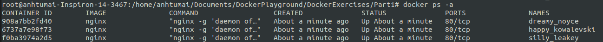

## Part 1

### Domain knowledge 

Docker Image: a file built according to an instruction called Dockerimage. It is a __template__ defining application and its dependencies. 

(```docker build``` => create a docker image)

Docker Container: A running instance of an image. It can be a runtime environments, to host one main process. We can start/stop/interact with container. 

(```docker run <image> ``` => create a docker container)

Realife Comparison: 
- Dockerfile: shopping list 
- Image: ingredients
- Container: the real meal 
- Build image with Dockerfile and run the image to create a container

### 1.1 Getting started

```
docker run -d <image>
docker stop <id>
```




### 1.2 Cleanup

```
docker stop
docker system prune 
```


### 1.3 Hello Docker Hub


### 1.4 

```docker exec -it <container-id> sh```


### 1.5 

To init a non-existing ubuntu container:
```
docker run -i -d --name ubuntu ubuntu:18.04
```

Access container's shell scripting:

```
docker exec -it ubuntu sh
```
Use command line as normal:
```
apt-get update
apt-get -y install curl
curl http://helsinki.fi
```


### 1.6

[Dockerfile](./ex16/Dockerfile)
```
cd ex16
docker build -t docker-clock 
docker run docker-clock
```


### 1.7 

[Dockerfile](./ex17/Dockerfile)
```
cd ex17
docker build -t curler .
docker run -it curler 
```


### Recap about Dockerfile 

Dockerfile is a text file that defines a Docker image. You will use a Dockerfile to create your own custom Docker image, in other words to define custom environment to be used in a Docker container.

```docker build .``` => Build a docker image from Dockerfile 

Some standard instructions:
- FROM: (FROM <image>[:tag = latest]): inherit from existing image (so you don't need to build things from scratch) (FROM scratch/ FROM ubuntu) 
- WORKDIR: set up work directory 
- COPY:  
- RUN: run commands (usualy used to install dependency) 
RUN <command> or 
- ENV: set up enviromental variable  
- EXPOSE: get your port right 
- CMD: 

- VOLUME: use this when you want to tell Docker that the stuff ouputted by container will be stored on __a host file system__ instead of container file. The same thing to achieve this goal is 
```docker run -v <host_path>:<docker_container_path> <image>```.

Best practices: 
- __Single__ responsibility 
- Container should be stateless 


### 1.8 

```
docker run -d devopsdockeruh/first_volume_exercise 
docker cp "<container_id>://usr/app" . 
docker run -v $(pwd)/app:/usr/app devopsdockeruh/first_volume_exercise 
cat app/logs.txt
```


### 1.9
```
docker run -d -p 80 devopsdockeruh/ports_exercise 
```


### 1.10
[Dockerfile](./ex110/Dockerfile)
```
$>docker build . 
Successfully built b14bf59c666d
$>docker run -p 5000:5000 b1
```

### 1.11

[Dockerfile](./ex111/Dockerfile)

```
$> docker build .
Successfully built 47f30be51eff
$> dockerun -it -d -p 8000:8000 -v "$PWD"/ex111/backend-example-docker:/usr/src/app/backend-example-docker 47 
$> curl http://localhost:8000/
Port configured correctly, generated message in logs.txt
$> cat ex111/backend-example-docker/logs.txt
5/2/2020, 9:56:33 PM: Connection received in root
```


### 1.12

[Dockerfile for frontend](./ex110/Dockerfile)

[Dockerfile for backend](./ex111/Dockerfile)
```
$> docker build -t frontend ex110
$> docker build -t backend ex111
$> docker run -it -d -p 5000:5000 -v "$PWD"/ex110/frontend-example-docker:/usr/src/app/frontend-example-docker frontend
$> docker run -it -d -p 8000:8000 -v "$PWD"/ex111/backend-example-docker:/usr/src/app/backend-example-docker backend
```


### 1.13 


```
$> docker build -t java-backend ex113
$> docker run -it -d -p 8080:8080 java-backend 
```


### 1.14

```
$> docker build -t rail-backend ex114
$> docker run -it -d -p 3000:3000 rail-backend 
```


