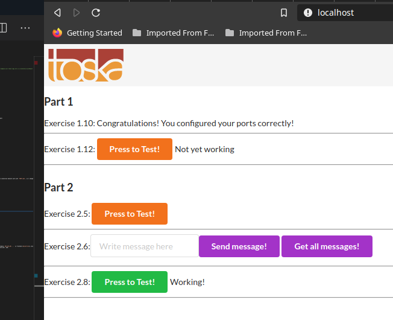
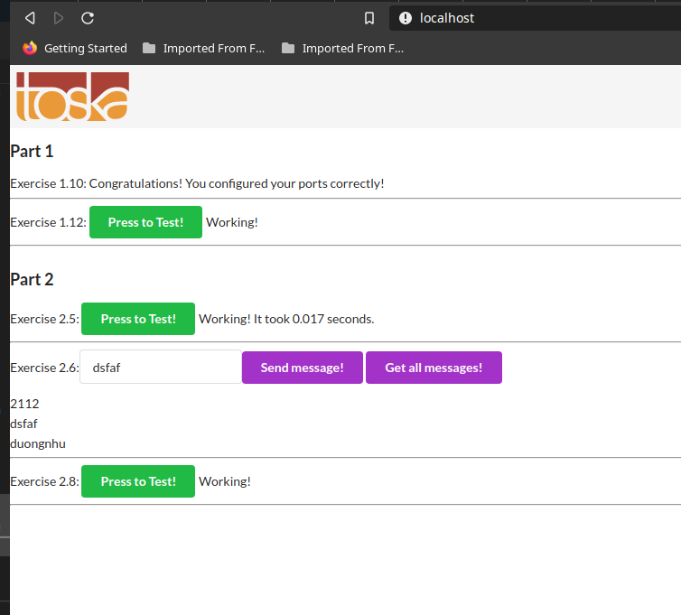

# Part 2

## Exercises

### 2.1

[docker-compose.yml](./ex1/docker-compose.yml)

```shell
$> cd ex1
$> touch app/logs.txt # this is important, since docker-compose will think logs.txt is a directory by default
$> docker-compose up
```


### 2.2

[docker-compose.yml](./ex2/docker-compose.yml)

```shell
$> cd ex2
$> docker-compose up -d
$> curl localhost:8000
Ports configured correctly!!
```


### 2.3

[docker-compose.yml](./ex3/docker-compose.yml)

```yaml
version: "3.5"

services:
  frontend:
    ports:
      - 5000:5000
    build: ../../Part1/ex110
  backend:
    ports:
      - 8000:8000
    build: ../../Part1/ex111
    volumes:
      - ./logs.txt:/backend-example-docker/logs.txt
```

### 2.4

[docker-compose.yml](https://github.com/docker-hy/scaling-exercise/blob/master/docker-compose.yml)

```shell
# Work directory: scaling-exercise
$> docker-compose up --scale compute=2
```


### 2.5

[docker-compose.yml](./ex5/docker-compose.yml)

```yaml
version: "3"
services:
  frontend:
    build: ./frontend
    image: frontend
    ports:
      - 5000:5000

  backend:
    build: ./backend
    image: backend
    ports:
      - 8000:8000
    environment:
      - REDIS=redis
      - REDIS_PORT=6379
  redis:
    image: redis:alpine
    ports:
      - 6379:6379
```


### 2.6

[docker-compose.yml](./ex6/docker-compose.yml)

```yaml
database:
  image: postgres
  restart: always
  environment:
    - POSTGRES_PASSWORD=password
    - POSTGRES_USER=anhtumai
```

**Note**: After some experimenting, backend and database connection doesnot work with `FROM node`, so I change Docker file in backend and frontend service to `FROM ubuntu:18.04`.


### 2.7

Skipped

### 2.8

[docker-compose.yml](./ex8/docker-compose.yml)

```yaml
proxy:
  depends_on:
    - frontend
    - backend
  restart: always
  image: nginx:alpine
  ports:
    - 80:80

  volumes:
    - ./nginx.conf:/etc/nginx/nginx.conf:ro
```



### 2.9

[docker-compose.yml](./ex9/docker-compose.yml)

```yaml
database:
  image: postgres
  restart: always
  environment:
    - POSTGRES_PASSWORD=password
    - POSTGRES_USER=anhtumai
  volumes:
    - ./database:/var/lib/postgresql/data
```

```shell
$> sudo su
$> docker-compose up -d
$> docker-compose down
$> rm -R database
$> docker-compose up -d
```


### 2.10

First, copy the docker-compose.yml in ex8. You need to remove `ENV API_URL ...` in frontend [Dockerfile](../Part1/ex10/Dockerfile). In [docker-compose.yml](./ex10/docker-compose.yml), add:

```yaml
frontend:
  ports:
    - 5000:5000
  build: frontend
  environment:
    - API_URL=http://localhost:80/api
```


