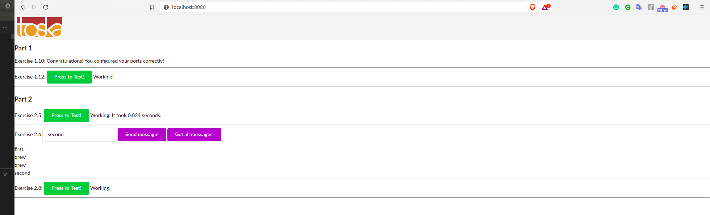

## Part 2 

### Docker compose 

Compose is a tool for defining and running multi-container Docker applications
- Multiple isolated environments on a single host 
- Preserve volume data when containers are created 
- Only recreate containers that have changed 
- Variables and moving a composition between environments 

In short, Compose enables running __multiple containers__ on a __single host__  with a __single__ command. To use with __multiple host__, Ks8 is the way to go.

Normally, Docker containers run in __isolation__ but Docker Compose finds a way to make them __communicate__. 

All Docker Compose files are __YAML__ files.

Example: A big website need to call to __multiple__ applications 

__Note__: LC_ALL: force all application use default language for output (English)

Basic commands: 

- docker-compose up: create and start containers 
- docker-compose down: stop and remove containers,
networks, images, volumes.

- docker-compose build: build/rebuild services. 
(Service is a group of at least 1 containers)

To understand docker-compose file, it is essential to understand the command line arguments
of docker run first. 

```
services:
    <image name>:
        image: <image name>
        build: <build folder (containg the image)>
            ( = docker build <build folder>)
        ports: 
            - host_port:container_port
            ( = docker run -p)
        volumes: 
            - host_path:container_path
            (host_path can be relative path)
            ( = docker run -v)
        environments: 
            - <container_ENV_var>=<value>
            ( = docker run -e)
```


### 2.1 

[Docker Compose file](./ex1/docker-compose.yml)

```
$> cd ex1
$> touch app/logs.txt # this is important, since docker-compose will think logs.txt is a directory by default
$> docker-compose up
```


### 2.2 

[Docker Compose file](./ex2/docker-compose.yml)
```
$> cd ex2
$> docker-compose up -d
$> curl localhost:8000
Ports configured correctly!!
```


### 2.3

[Docker Compose file](./ex3/docker-compose.yml)
```
version: '3.5'

services:
    frontend:
        ports:
            - 5000:5000
        build: ../../Part1/ex110
    backend:
        ports:
            - 8000:8000
        build: ../../Part1/ex111
        volumes: 
            - ./logs.txt:/backend-example-docker/logs.txt

```


### 2.4

[Docker Compose file](./scaling-exercise/docker-compose.yml)

```
$> docker-compose up --scale compute=2
```


### 2.5

[Docker Compose file](./ex5/docker-compose.yml)

```
version: '3'
services:
    frontend:
        build: ./frontend
        image: frontend 
        ports: 
            - 5000:5000

    backend:
        build: ./backend
        image: backend 
        ports: 
            - 8000:8000
        environment: 
            - REDIS=redis
            - REDIS_PORT=6379
    redis:
        image: redis:alpine
        ports:
            - 6379:6379

```


### 2.6

[Docker-compose file](./ex6/docker-compose.yml)

```
  database:
    image: postgres
    restart: always
    environment:
      - POSTGRES_PASSWORD=password
      - POSTGRES_USER=anhtumai
```


__Note__: After some experimenting, backend and database connection doesnot work with ```FROM node```, so I change Docker file in backend and frontend service to ```FROM ubuntu:18.04```. 


### 2.7

Skipped 

### What is reverse proxy (nginx)? 

1. Proxy 

A proxy acts as a gateway between you and the Internet. 

> Your computer makes a request to a web server. In this case, a proxy acts as a medium between you and the server, making a request __on your behalf__. There are some benefits: 
> - data security (the request will use proxy IP address, firewall,filter, ... )
> - cache data improve performance


2. Reverse Proxy 

Reverse Proxy is not used by the client, but is used by __server admins__. It intercepts requests from clients, send and receive responses from the origin server. 


Benefits of reverse proxy: 

- Load balancing: Provide solution to handle millions of requests per day. 
- Protection from attack
- Global Server Load Balancing 
- Caching: this concept is intertwined with CDN. To load a Youtube video from Helsinki, it is highly likely that your laptop gets data from a reverse proxy/CDN in Europe instead of  
- TLS encryption


### 2.8 

[Docker-compose file](./ex8/docker-compose.yml)

```
    proxy:
        depends_on: 
            - frontend
            - backend
        restart: always
        image: nginx:alpine
        ports: 
            - 8080:80
        
        volumes:
            - ./nginx.conf:/etc/nginx/nginx.conf:ro
```


### 2.9 

[Docker-compose file](./ex9/docker-compose.yml)

```
    database:
        image: postgres
        restart: always
        environment:
            - POSTGRES_PASSWORD=password
            - POSTGRES_USER=anhtumai
        volumes: 
            - ./database:/var/lib/postgresql/data
```

```
$> sudo su
$> docker-compose up -d 
$> docker-compose down
$> rm -R database
$> docker-compose up -d
```


### 2.10

Same as 2.8, excepts that you need to add envir

