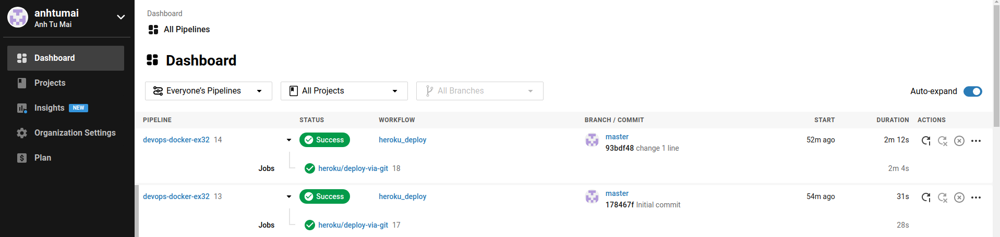
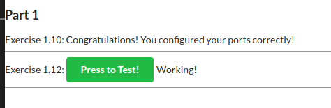
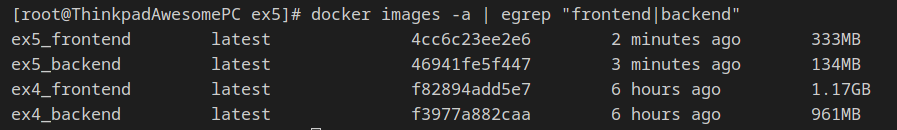
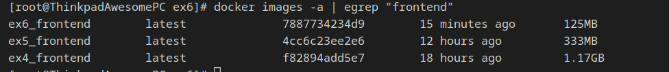

# Part 3

## Exercises

### 3.1

Frontend Dockerfile: [Dockerfile](./ex1/ex1a/Dockerfile) (490MB)

Backend Dockerfile: [Dockerfile](./ex1/ex1b/Dockerfile) (196MB)

### 3.2

Github Repository: [https://github.com/anhtumai/devops-docker-ex32](https://github.com/anhtumai/devops-docker-ex32)

Heroku App URL: [https://devopswithdockertask32.herokuapp.com/](https://devopswithdockertask32.herokuapp.com/)

Circle CI pipeline:



### 3.3

Bash script to clone, build and push Docker image to Docker Hub: [main.sh](./ex3/main.sh)

Docker file: [Dockerfile](./ex3/Dockerfile)

Inventory file format: [inventory](./ex3/inventory)

Usage:

```shell
$> sudo docker build . -t clone_push
$> sudo docker run -it -v /var/run/docker.sock:/var/run/docker.sock -v $PWD/inventory:/usr/src/inventory clone_push
```

### 3.4

Frontend Dockerfile: [Dockerfile](./ex4/frontend/Dockerfile)

Backend Dockerfile: [Dockerfile](./ex4/backend/Dockerfile)

```shell
# Working directory: ./ex4
$> docker-compose up
```



### 3.5

Frontend Dockerfile: [Dockerfile](./ex4/frontend/Dockerfile)

Backend Dockerfile: [Dockerfile](./ex4/backend/Dockerfile)

```shell
# Working directory: ./ex5
$> docker-compose up
```

Image sizes before and after the change:



### 3.6

Frontend Dockerfile: [Dockerfile](./ex6/frontend/Dockerfile)

```shell
#Working directory: ./ex6
$> docker build . -t ex6-frontend
$> docker run ex-frontend
```

Image sizes before and after the change:



### 3.7

Frontend Dockerfile: [Dockerfile](./ex7/frontend/Dockerfile)

Backend Dockerfile: [Dockerfile](./ex7/backend/Dockerfile)

```shell
#Working directory: ./ex7
$> docker-compose up
```

### 3.8

skipped
